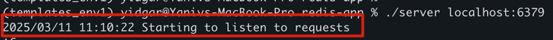

# preparations 
```sh
alias k="kubectl"
export NS="gutsy"
k create ns $NS
````

# Description 
TBD - ADD image here 

# Steps 
## 1. build the go app 

```shell
# For MAC, check locally 
go build -o server main.go

# For Linux (use in Dockerfile) 
GOOS=linux GOARCH=amd64 GOAMD64=v4 go build -o server main.go

```
## 2. create deployment for Redis 
use redis:7.2-alpine  

## 3. copy data.rdb to the minikube 
```shell
minikube ssh
sudo mkdir /mnt/data/redis
minikube cp redis-app/data.rdb /mnt/data/redis/
```

## 4. check the go server app locally 
```shell
# 1. deploy the Redis to local minikube
k deploy -f redis-deployment.yaml

# 2. get the pod name 
k get pods -n $NS 

# 3. expose the pod  
k port-forward pod/redis-deployment-{id} -n $NS 6379:6379

# 4. runh the server app 
./server localhost:6379 
```



## 5. Create Dockerfile and build it
Assume x86-64 architecture on Linux (ELF) 
```shell
docker build -t yidgar11/server:1.0
```

## 6. create server-deployment and use the yidgar11/server:1.0 image
## 7. Deploy the server-deployment.yaml 
```shell
k deploy -f server-deployment.yaml
```

verify the service is up nd check logs
```shell
k get pods -n $NS 
k logs pod/server-deployment-{id} -n $NS
```

