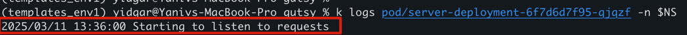
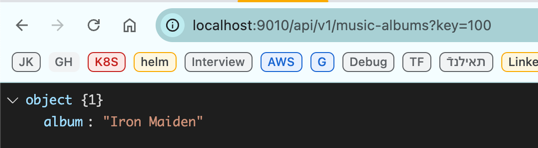

# preparations
## Aliases and Env
```sh
alias k="kubectl"
alias tf="terraform"
export NS="gutsy"
k create ns $NS
````

## Create redis password
```shell
 echo -n "redispass" | base64
```
update the password in the redis-secret.yaml

# To deploy project using terraform 

```shell
tf init 
tf valudate
# check that the terraform plan command success  
tf plan 
# run terraform apply  
tf apply [optiona --auto-approve] 

(to clear , use terrafrom destroy command ) 
```
expose the server servcie 
```shell
k port-forward service/gutsy-server-container-service -n $NS  9010:9090
```
and chck API from browser 


# Steps for creatioin of the project 
## 1. Build the go app

```shell
# For MAC, check locally
go build -o server main.go

# For Linux (use in Dockerfile)
GOOS=linux GOARCH=amd64 GOAMD64=v4 go build -o server main.go
```

## 2. Create deployment for Redis
use redis:7.2-alpine

## 3. Copy data.rdb to the minikube
```shell
minikube ssh
sudo mkdir /mnt/data/redis
minikube cp redis-app/data.rdb /mnt/data/redis/
```

## 4. Deploy the redis and check the go server app locally
```shell
# 1. deploy the Redis to local minikube
k deploy -f pv.yaml
k deploy -f pvc.yaml
k deploy -f redis-deployment.yaml
k deploy -f redis-comfigmap.yaml

# 2. get the pod name
k get pods -n $NS

# 3. expose the pod
k port-forward pod/redis-deployment-{id} -n $NS 6379:6379

# 4. run the server app
./server localhost:6379
```


## 5. Create Dockerfile for the redis-app and build it
Assume x86-64 architecture on Linux (ELF)
```shell
docker build -t yidgar11/server:1.0
```

## 6. Create server-deployment and use the yidgar11/server:1.0 image
## 7. Deploy the server-deployment.yaml
```shell
k deploy -f server-deployment.yaml
```

## Verifications
### Verify the service is up and check logs
```shell
k get pods -n $NS
k logs pod/server-deployment-{id} -n $NS
```


### Verify the redis is up and loaded the database
```shell
k logs pod/redis-deployment-bcbf5f55d-fsgdd -n $NS
```


## 9. Check API



